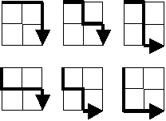

# Problem statement
Starting in the top left corner of a 2×2 grid, and only being able to move to the right and down, there are exactly 6 routes to the bottom right corner.

How many such routes are there through a 20×20 grid?

# Solution
The path from the top left corner to the bottom right corner for n×n grid always consists of n right moves and n down moves, the answer is the number of possible arrangements which can be calculated through combinations, large factorials can be calculated using cache